# Wine Cellar Manager

[](https://hacs.xyz/docs/faq/custom_repositories)
[](https://github.com/kedube/ha-wine-cellar-manager/releases)
[](LICENSE)

A Home Assistant integration and dashboard card for managing one or more wine cellars locally. Each cellar is drawn the way it is physically laid out, shelf by shelf and row by row, so you can find a bottle by where it sits. Optionally, Google Gemini can read a label or barcode photo and fill in the bottle details for you.

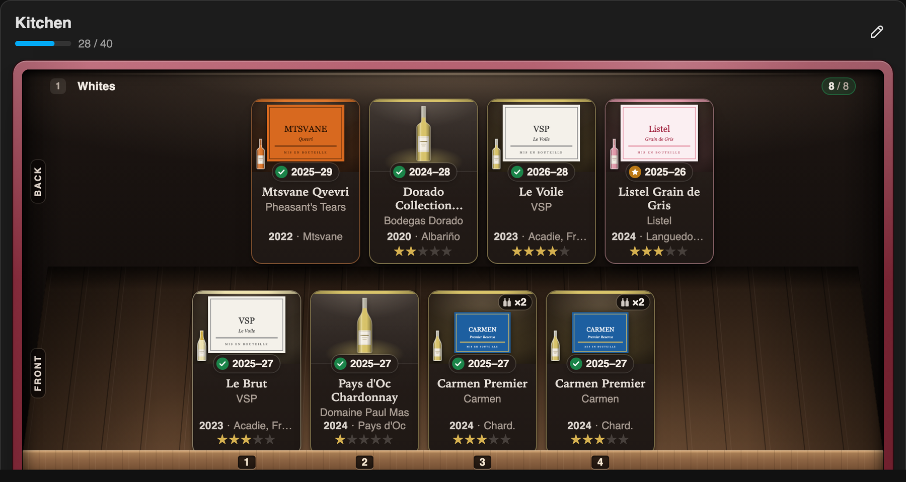

## Contents

- [Requirements](#requirements)
- [Installation](#installation)
- [Configuration](#configuration)
- [Adding the card](#adding-the-card)
- [Features](#features)
- [Views](#views)
- [Notes](#notes)
- [Known issues and to do](#known-issues-and-to-do)
- [Development](#development)
- [Credit](#credit)
- [License](#license)

## Requirements

- Home Assistant 2024.7.0 or newer
- [HACS](https://hacs.xyz/) (for the recommended installation method)
- Optional: a Google Gemini API key, used to analyze label and barcode images (see [Obtaining a Gemini API key](#obtaining-a-gemini-api-key))

## Installation

### HACS (recommended)

This integration is not in the HACS default store, so add it as a custom repository.

[](https://my.home-assistant.io/redirect/hacs_repository/?owner=kedube&repository=ha-wine-cellar-manager&category=integration)

Or add it manually:

1. In Home Assistant, open **HACS**.
2. Open the three-dot menu in the top right corner and select **Custom repositories**.
3. Enter `https://github.com/kedube/ha-wine-cellar-manager` as the repository and select **Integration** as the type, then select **Add**.
4. Search for **Wine Cellar Manager** in HACS, open it, and select **Download**.
5. Restart Home Assistant.

### Manual

1. Download `wine_cellar_manager.zip` from the [latest release](https://github.com/kedube/ha-wine-cellar-manager/releases/latest).
2. Unzip it into your Home Assistant `config/custom_components/` folder, so that you end up with `config/custom_components/wine_cellar_manager/manifest.json`.
3. Restart Home Assistant.

## Configuration

### Add the integration

[](https://my.home-assistant.io/redirect/config_flow_start/?domain=wine_cellar_manager)

Or add it manually:

1. Go to **Settings** > **Devices & services**.
2. Select **Add integration** and search for **Wine Cellar Manager**.
3. Enter a title for the integration (or keep the default) and select **Submit**.

The integration registers the dashboard card automatically, so there is no separate frontend resource to install.

### Options

To set up Gemini or change image storage, go to **Settings** > **Devices & services** > **Wine Cellar Manager** and select **Configure**.

| Option | Default | Description |
| --- | --- | --- |
| Default image base path | `/local/wine_labels` | URL path used to display label images. Leave as is unless you have a reason to change it. |
| Server upload folder under /config | `www/wine_labels` | Folder, relative to `/config`, where uploaded label images are stored. Must match the base path above. |
| Enable demo enrichment hooks | On | Enables built-in enrichment hooks. |
| Gemini API key | *(empty)* | Needed only for label and barcode analysis. |
| Gemini model | `gemini-3.6-flash` | Gemini model used for analysis. Leave as is. |

`gemini-3.6-flash` is the most robust model for this use, includes free daily tokens (enough to build a reasonable cellar), and works better than newer models whose free tiers are limited to their "lite" variants. The integration hasn't been tuned for other models.

### Obtaining a Gemini API key

A Gemini API key works with any model, though some models may require payment information. `gemini-3.6-flash` is free with daily limits, which is enough for Wine Cellar Manager. Like any AI, it can hallucinate or return wrong information, so review what it fills in.

Getting a key is free and takes a few minutes in Google AI Studio:

1. Go to [Google AI Studio](https://aistudio.google.com/welcome) and sign in with your Google account.
2. Accept the Terms of Service if this is your first time using the platform.
3. Select **Get API key** in the left-hand sidebar.
4. Select **Create API key**.
5. Select or create a Google Cloud project when prompted, then select **Create key**.
6. Copy the key, store it securely, and paste it into the integration [options](#options).

## Adding the card

The card works best on its own dashboard using the **Panel** layout (a single card that fills the view).

1. Create a new dashboard, then edit its view and set the view type to **Panel (single card)**.
2. Select **Add card** > **Manual**.
3. Paste the following and select **Save**:

```yaml
type: custom:wine-cellar-card
```

### Card options

| Option | Values | Default | Description |
| --- | --- | --- | --- |
| `background` | `wood` | Theme | By default the card follows your Home Assistant theme, light or dark. Set to `wood` to use a wood texture background instead. |
| `interior` | `theme` | Lit | By default every cabinet is drawn as a lit wine fridge (dark back wall, LED-lit shelves, wooden floor) in both light and dark themes. Set to `theme` to keep your Home Assistant theme colors inside the cabinets. |

```yaml
type: custom:wine-cellar-card
background: wood
interior: theme
```

## Features

- **Unlimited cellars**, each with its own name and a color (picked from swatches) that sets the finish of its cabinet frame (bordeaux lacquer, oak, olive, azure, slate, or brushed steel for Off White), so cellars are easy to tell apart.

  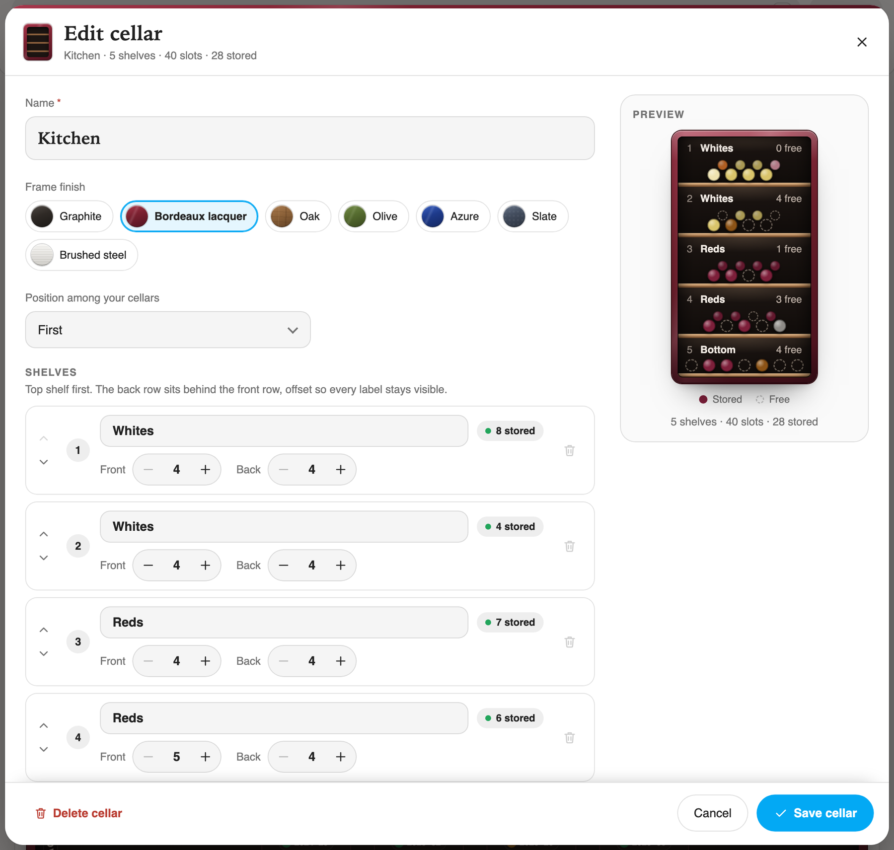

- **Per-shelf layout**: each shelf can have a front and/or back row and its own number of bottles per row, and can be named individually. This matches cellars that have, for example, sliding racks at the top and fixed shelves at the bottom.

  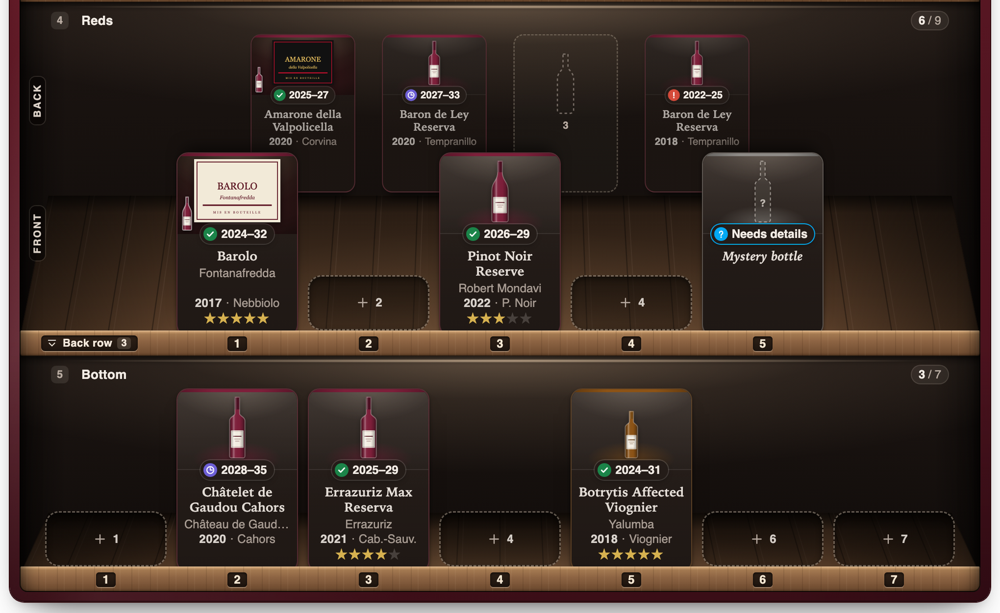

- **Shared label images**: identical bottles (same name and producer) share a single label image on disk, so cloning or adding similar wines doesn't duplicate files.

- **Detailed bottle records**. Only the name is required:
  - name
  - label image (JPG, PNG, WEBP, or GIF)
  - type (red, white, sparkling, rosé, orange, sweet, or other)
  - varietals (complex blends are shown as "Blend" in the Cellar view)
  - vintage
  - producer
  - region
  - country
  - start and end of the aging period
  - price
  - serving temperature
  - alcohol content
  - personal rating
  - personal notes
  - link (defaults to SAQ.com, but any URL can be used)

- **Four views**: Cellar, Compact, All Bottles, and Statistics.

- **Languages**: the card and setup screens follow your Home Assistant language and ship with English, French, German, Spanish, Italian, Dutch, Portuguese, and Polish. Other languages fall back to English.

## Views

### Cellar view

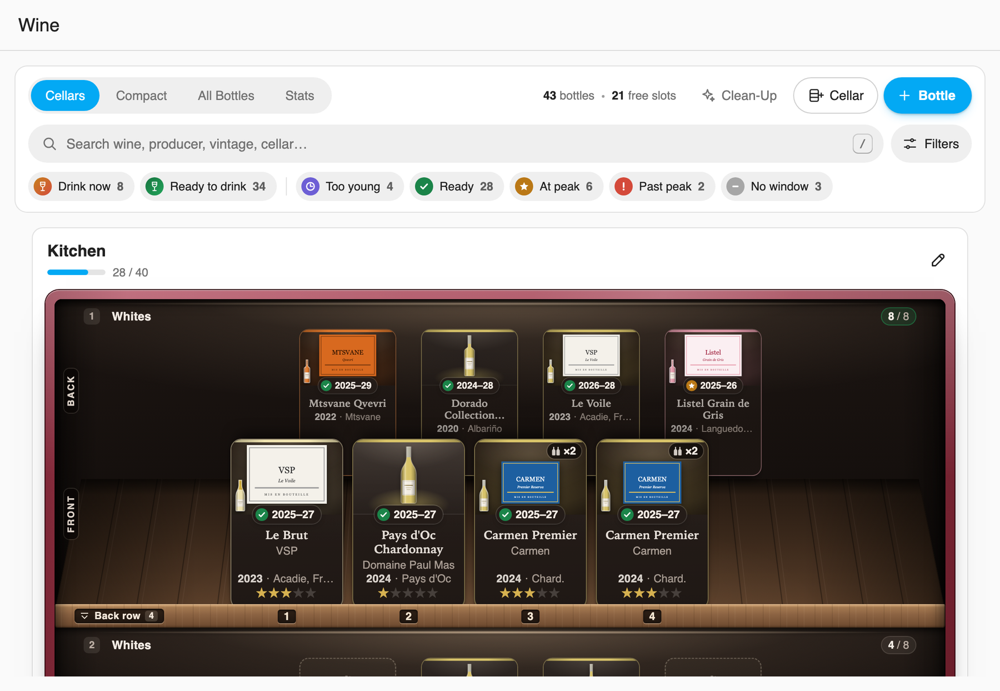

This is the default view. It shows every cellar the way it is physically laid out, with useful information about each bottle. Each cellar is drawn as a lit wine fridge seen at eye level, with a frame in the cellar's finish. Its header shows how full it is (for example `28 / 40`), and the pencil button at the top right edits it.

Shelves appear in the order set within the cellar. Each shelf is a compartment with an LED strip, a wooden floor and a wooden lip at the front that carries the number of each front position.

- On shelves with two rows, the back row stands behind the front row: smaller, in shade, and staggered into the gaps between the front bottles, the way a real rack holds them. At rest a back bottle shows its label, status, name and vintage.
- Tap a shelf's lip, or the **Back row** plate on it, to pull the shelf out: the rows separate and the back row comes forward with every detail. Tap again or press Escape to push it back. Only one shelf is out at a time.
- A search that finds a bottle in a back row pulls its shelf out by itself.
- Empty front positions are low "+" outlines on the floor, and empty back positions are faint bottle outlines. Tap either to add a bottle there. While a bottle is being dragged, every empty position becomes a full-size drop target.
- On a phone, a cellar wider than the screen scrolls sideways. It starts at position 1 and remembers where you left it, and edge fades and "‹ n / n ›" chips show how many bottles are out of view.

Each bottle card shows the bottle drawn in its style (Bordeaux, Burgundy, Champagne, a tall Alsace/Riesling bottle, a half bottle for sweet wines, or a Port bottle) in the color of its type. With a label photo, the whole label is shown, never cropped, with a small bottle in the corner. Under it come a status chip with the drinking window, the name, the producer, the vintage and grape (or region for France), and the rating. Identical bottles show a ×N badge, and hovering a bottle outlines every other bottle of the same wine. A bottle with no type or details shows a dashed "?" bottle and a **Needs details** chip.

The status chip pairs a symbol with a color, so it never relies on color alone:

- **◷ Too young** (violet)
- **✓ Ready to drink** (green)
- **★ At peak**: the current year is the last year of the aging period (amber)
- **! Past peak** (red)
- **– No window**: the aging period is not set

A legend under the filters repeats these symbols with the number of bottles in each state.

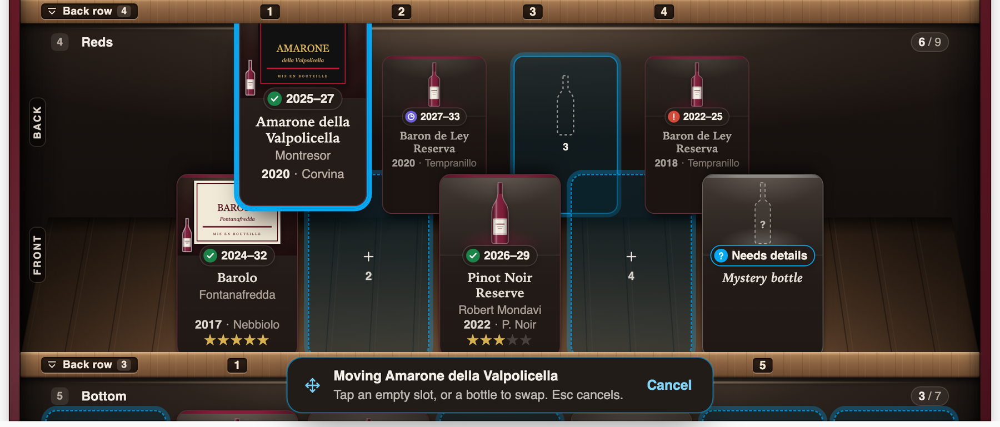

Individual cards can be dragged and dropped at will. Bottles can be moved to an empty slot or swapped; the slot under the pointer is highlighted before you let go. This works on PC, tablet, or mobile, and mirrors how people physically interact with a cellar. It also works in the Compact view.

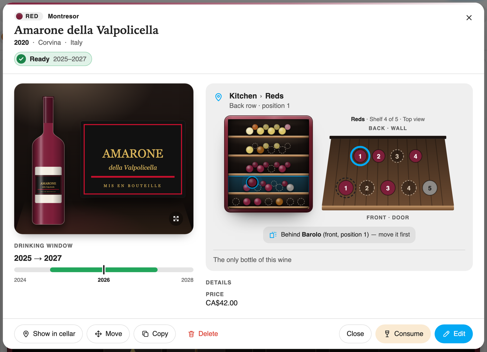

Clicking on a card opens the Bottle view. Its header shows the wine's type, producer, name, vintage and origin, its drinking-window status and its rating. Below, the bottle is shown wearing its label next to the full label photo (tap it to open the photo), or with an **Add label photo** button when there is none.

The location block shows where the bottle is (cellar, shelf, front or back row, position), a small cabinet with the shelf highlighted, and a top view of that shelf. For a back-row bottle it names the bottle in front of it, for example "Behind Barolo (front, position 1) — move it first". It also says how many bottles of this wine you have, with **Find all** to search for every one of them. The drinking-window timeline and the remaining details follow.

- **Show in cellar** closes the view and brings the bottle into view in the Cellar view, pulling its shelf out if it is in a back row.

- **Delete** removes the bottle and all its information, after a confirmation inside the window.
- **Consume** removes the bottle from the cellar but keeps its information, so it can be reused if a similar bottle is added later.
- **Edit** opens the edit window (see below).
- **Copy** temporarily keeps the bottle data in memory and closes the view. A banner confirms the copy and every empty slot pulses; clicking one copies all the fields into that slot, making it quick to add a second similar bottle. The copy can be cancelled from the banner, and expires after 10 minutes.

On phones, Show in cellar, Copy and Delete are in the "…" menu next to Consume and Edit.

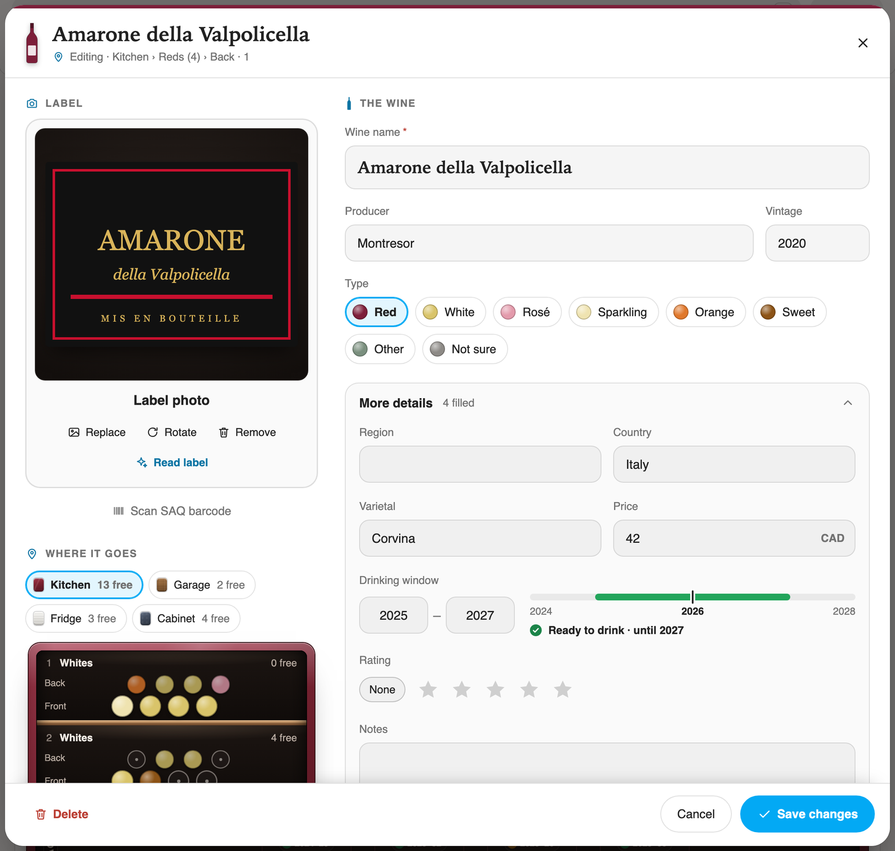

In the Edit window, each field can be filled at will, with only Name being required. Autocomplete (based on existing and consumed wines) is active for name, producer, varietal, region, and country. You can also search the history by typing any of the main fields, and select a suggestion to auto-fill the bottle.


At the top of the Edit window you can upload a label image or a barcode image. Selecting **Analyze** with a label image has Gemini read the label and fill the bottle fields. If there is no label but there is a barcode image, **Analyze** asks Gemini to extract the barcode number. Once a barcode number exists (extracted by Gemini or entered manually), **Analyze** has Gemini look up the wine on SAQ.com and fill the bottle fields. The barcode image is then deleted to save storage.

### Compact view

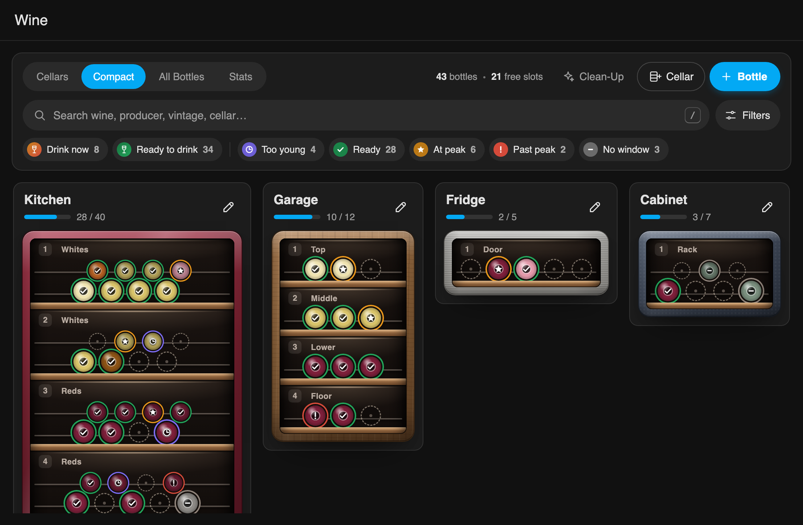

The Compact view has all the features of the Cellar view. The only difference is that each cellar is shown as if looking into an open wine fridge: every bottle is a glass bottle end on a wire rack, colored by wine type and circled by its aging status color, with the status symbol in the middle. Back-row bottles are smaller and darker, staggered behind the front ones. Hovering a bottle shows its name, producer, vintage, status and where it is. When a search finds only a few bottles, they pop forward. It is particularly useful on mobile or for a denser overview of several cellars. If the screen allows it, the card puts cellars side by side. This view is closer to what is typically seen in a cellar manager app.

### All Bottles

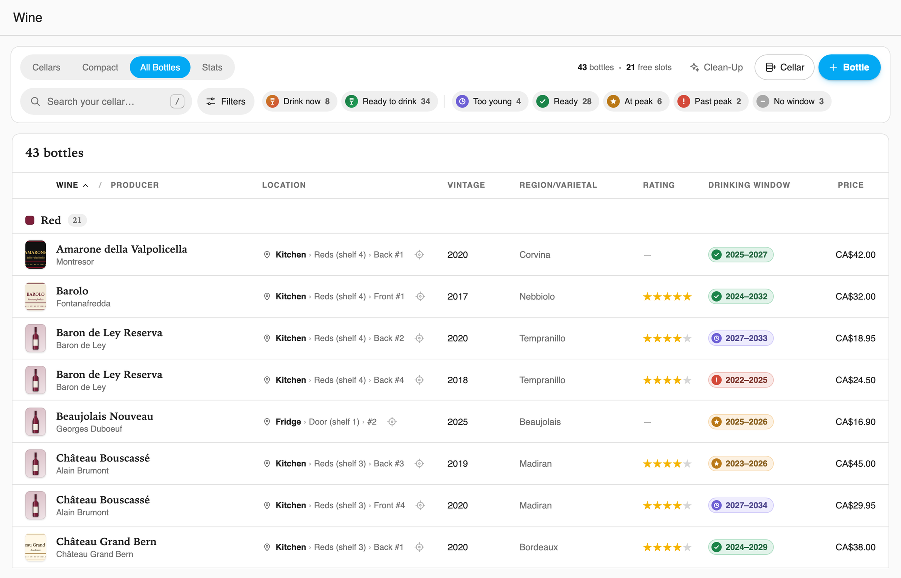

A table of all current bottles, grouped by type. The Location column shows where each bottle is stored (cellar, shelf, row, and position), and sorting by it lists bottles in the order they sit in your cellars. The Aging column shows the drinking window with its status symbol. Any column can be sorted in ascending or descending order. Clicking a row opens the same Bottle view as the Cellar and Compact views.

### Statistics

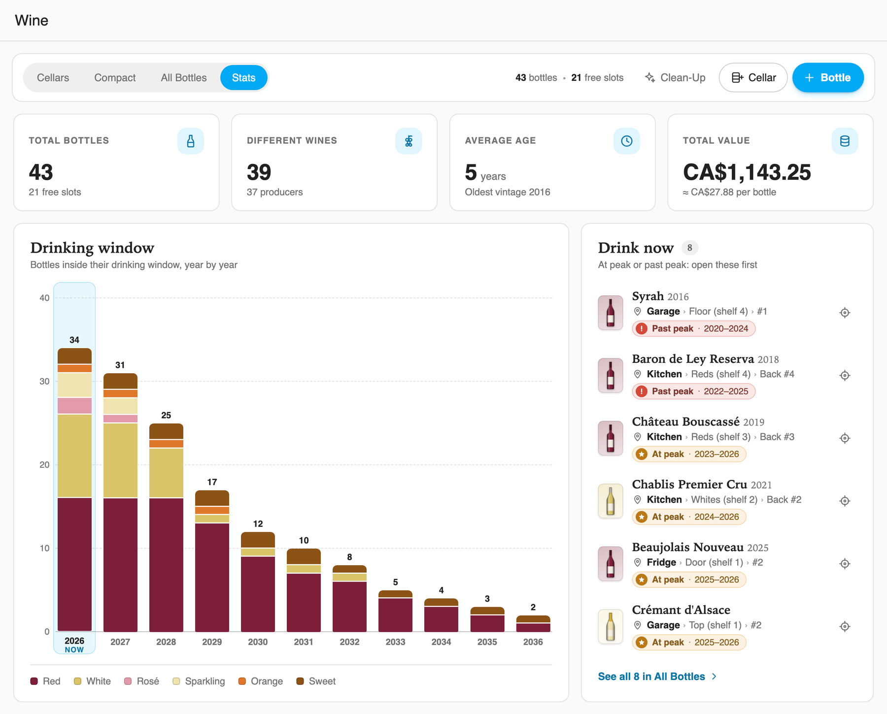

Information and statistics for the current inventory, including total value and how many bottles reach their peak in each upcoming year.

### Header controls

The header switches between the four views and offers three buttons:

- **+ Bottle**: opens the Add window on the next free slot (cellars in order, shelves top to bottom, front row before back). If every slot is taken, the header says so instead.
- **+ Cellar**: opens a window to create and configure a new cellar. It is the same window used to edit a cellar. Each shelf shows how many bottles it holds, and a shelf that still holds bottles can't be removed.
- **Clean-Up**: analyzes the whole inventory and identifies possible duplicates (for instance, similar but not identical names, or misspelled varietals). For each case, it proposes a fix and lets you decide which entry to keep.

  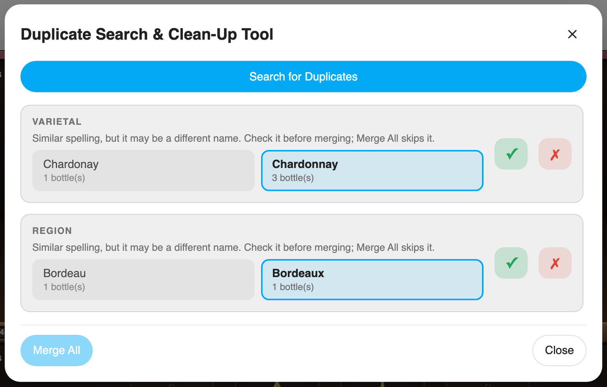

### Filters

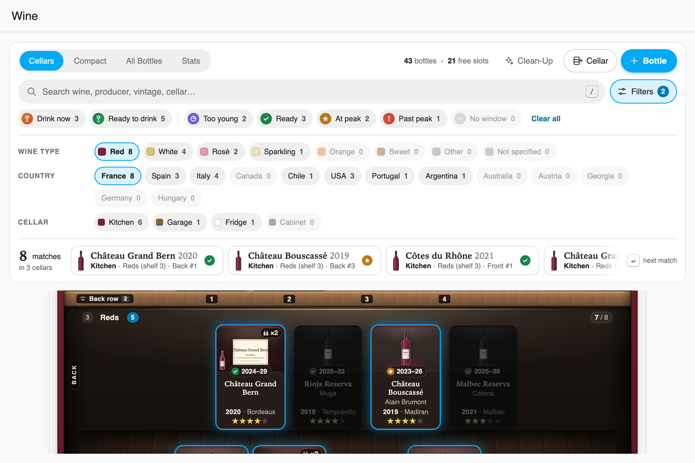

Every view except Statistics has filtering options. While any filter is active, matching bottles stay highlighted, the others fade, and the header shows how many bottles match. Under the filters, a summary line gives the number of bottles, the free slots, and how many bottles are in each aging state.

- **Search**: filters as you type. Every word must match somewhere in the name, producer, varietal, region, country, vintage, type, cellar, shelf, row or notes, and accents are ignored (`chateau` finds `Château`). If no match is on screen, the first one scrolls into view. Press `/` to jump to the search box and Escape to clear it. **Clear filters** resets the search and every filter.
- **Aging**: shows bottles that are **Ready to drink** (the current year falls within their aging period) or to **Drink now** (bottles in their final peak year, or past it).

  

- **Type** and **Country**: filter by wine type or country of origin.

  

### Layout details

- **Balanced shelves**: every shelf spans the full width of its cabinet and its rows are centered, so shelves of different sizes line up cleanly.
- **Mobile friendly**: cellars scale to the full screen width in portrait mode. A cabinet wider than the screen scrolls sideways as a whole, opens centered on its bottles, and keeps each shelf's name in view while scrolling.
- **Landscape and wide screens**: multiple cellars are shown side by side on mobile in landscape, tablets, or wider monitors when there is room.
- **Theme aware**: all surfaces, text, and accents come from the active Home Assistant theme, so the card follows light mode, dark mode, and custom themes.
- **Compact header**: the header stays anchored on larger screens, and extra padding is dropped on small phone screens.
- **Scroll position**: your scroll position is kept after minor interface refreshes.
- **Keyboard support**: bottles and empty slots can be reached with Tab and opened with Enter or Space. Windows keep keyboard focus inside them, close with Escape, and return focus to where you were. Closing a window with unsaved changes asks first.

## Notes

- **Currency**: prices are shown in the currency set in Home Assistant (**Settings** > **System** > **General**), and Gemini is asked for prices in that currency. Prices you already saved are not converted.
- **Québec references**: the integration was originally built for personal use in Québec, Canada, so some features refer to the SAQ (Québec's provincial liquor retailer), such as the default bottle link and barcode lookups on SAQ.com.
- **Translations**: the integration was originally written in French and translated during development, so some wording quirks may remain.
- **AI-assisted code**: large parts of the code were debugged, optimized, and refactored with the help of AI tools.

## Known issues and to do

- Barcode recognition is not fully reliable yet, because of variations in image angle.
- Add an option to use a custom domain or another source instead of SAQ.com for AI lookups.

Bugs and feature requests: [open an issue](https://github.com/kedube/ha-wine-cellar-manager/issues).

## Development

### Checks

The CI workflow runs on every pull request, every push to `main`, and weekly:

- **Hassfest**: Home Assistant's validation of the manifest, translations, and services.
- **HACS validation**: checks the repository meets HACS requirements.
- **Python lint**: [Ruff](https://docs.astral.sh/ruff/) with the rules in `ruff.toml`, a compile check, and a check that every file in `translations/` has the same keys as `strings.json`.
- **Dashboard card**: a JavaScript syntax check, and a check that `dist/` matches the card in `custom_components/wine_cellar_manager/frontend/`.

To run the local checks before pushing:

```sh
uvx ruff@0.16.8 check
python3 scripts/check_translations.py
node --check custom_components/wine_cellar_manager/frontend/wine-cellar-card.js
```

### Releases

Releases are automated. Every push to `main` runs CI and then, if it passes, the Release workflow, which:

1. bumps the version from the latest tag: patch by default, or minor/major when a commit message since the last release has a line containing only `#minor` or `#major`;
2. writes the new version to `manifest.json`, commits it, and tags it;
3. publishes a GitHub release with `wine_cellar_manager.zip` attached.

Add `[skip release]` to a commit message to push without releasing, or run the workflow by hand from the Actions tab to pick the bump. Pull before pushing again, as each release adds a version commit to `main`. The release fails if `dist/wine-cellar-card.js` differs from the card in `custom_components/wine_cellar_manager/frontend/`, so copy it over after editing the card.

## Credit

Wine Cellar Manager was originally created by [bernarddery](https://github.com/bernarddery) as [Wine-Cellar-Manager](https://github.com/bernarddery/Wine-Cellar-Manager). This project builds on that work.

## License

Released under the [MIT License](LICENSE). The original author's copyright notice is retained as the license requires.
